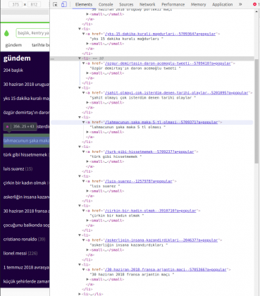

Herkese merhaba,

Bu yazıda web crawling’e basit bir giriş yapacağız ve Python’un bize verdiği yetkiye dayanarak Ekşi Sözlük’te gündemdeki başlıkları url’leriyle birlikte çekip bir dosyaya kaydedeceğiz.

Yavaştan başlayalım. Her şeyden önce sadece proje için bize lazım olan paketleri yükleyeceğimiz yeni bir virtual environment oluşturacağız. Bunun için linux’ta `virtualenv` komutunu kullanarak **eksi_crawler** adında bir virtual environment oluşturuyoruz:

```shell
bassman@rog:~$ virtualenv eksi_crawler
Running virtualenv with interpreter /home/bassman/anaconda3/bin/python3
Using base prefix '/home/bassman/anaconda3'
New python executable in /home/bassman/eksi_crawler/bin/python3
Also creating executable in /home/bassman/eksi_crawler/bin/python
Installing setuptools, pkg_resources, pip, wheel...done.
bassman@rog:~$ source eksi_crawler/bin/activate
(eksi_crawler) bassman@rog:~$
```

Eğer virtualenv paketi hazırda kurulu değilse pip kullanarak kurabilirsiniz:

```shell
bassman@rog:~$ pip3 install virtualenv
```

Sonrasında ileriki kısımlarda ihtiyaç duyacağımız paketleri kuruyoruz:

```shell
(eksi_crawler) bassman@rog:~$ pip3 install requests lxml
```

Bu paketlerin ne işimize yarayacağını yazının ilerleyen kısmında göstereceğim.

Şimdi de başlıkları ve başlık linklerini nasıl çekebileceğimize bakalım. Bunun için söz konusu sitenin (bu durumda ekşi sözlük oluyor) html kodlarına göz atmamız gerekiyor. Tarayıcıda "https://eksisozluk.com/basliklar/gundem" url’ine gidiyoruz. Buradaki başlıklardan birine sağ tıklayıp "Inspect Element" e tıklıyoruz. Yan tarafta açılan kısımda sitenin kaynak kodlarında başlıkların bulunduğu kısmı görebiliriz.



DOM’u biraz inceleyince şu sonuca varıyoruz: Tüm başlıklar bir liste içerisinde şu düzene göre sıralanmış:

```html
<ul class=”topic-list”>
  <li>
    <a href=”Başlık Linki”>Başlık</a>
  </li>
</ul>
```

Yani bunu Xpath olarak yazmak gerekirse şöyle yazabiliriz:

```python
"//ul[@class='topic-list']/li/a"
```

Xpath ile ilgili daha fazla bilgiyi [burada](https://www.w3schools.com/xml/xpath_intro.asp) bulabilirsiniz

Buraya kadar DOM’dan başlıkları ve başlık linklerini içeren DOM elementlerini nasıl çıkaracağımızı bulduğumuza göre asıl işi yapacak Python scriptini yazmaya başlayabiliriz.

Önce modüllerimizi import edelim

```python
import requests
from lxml import html
```

Daha sonra web sayfasının html içeriğini `requests` modülünü kullanarak çekelim:

```python
pg = requests.get("https://eksisozluk.com/basliklar/gundem")
```

Burada `requests` modülünü kullanmamızın nedeni bir web sayfasının içeriğini kendi makinemize çekebilmektir. Bunun için de requests modülünün `get` fonksiyonunu kullandık. Bu fonksiyon çok basit bir anlatımla muhatap olduğumuz server’a (burada [eksisozluk.com](https://eksisozluk.com)) istediğimiz sayfa/url için (burada [/basliklar/gundem](https://eksisozluk.com/basliklar/gundem)) GET request gönderir

> *Not*: Burada response’un içeriğini `pg.content`’e bakarak görebiliriz. Fakat 
> pg.content’in değeri encode edilmiş site içeriği (bytes) olduğundan ve 
> bizim ileride kullanacağımız fonksiyonlar bytes değil string kabul 
> ettiğinden, biz decode edilmiş halini kullanacağız. Decode edilmiş içeriğe 
> de `pg.text`’ten ulaşabiliriz.

Requests modülü hakkında daha fazla bilgi için [dokümantasyonlarına](http://docs.python-requests.org/en/master/) bakabilirsiniz.

Artık sitenin kaynak kodlarını çektiğimize göre bir DOM tree oluşturup istediğimiz bilgileri çekmenin vakti geldi. DOM tree oluşturmak için lxml.html modülünden faydalanacağız.

> *Not*: DOM tree nedir ne değildir bilmiyorsanız [şuraya](https://www.digitalocean.com/community/tutorials/understanding-the-dom-tree-and-nodes) bir göz atmanızda fayda var

```python
tree = html.fromstring(pg.text)
```

Burada `pg.text` değişkeni çektiğimiz HTML kodlarını içermekte. `html.fromstring` fonksiyonu da bu HTML kodlarını alıp bize bir DOM tree oluşturuyor.

Artık xpath kullanarak istediğimiz elementleri çekebiliriz:

```python
links = tree.xpath("//ul[@class='topic-list']/li/a")
```

Eğer `links` değişkeninin içeriğine bakarsak, şuna benzer bir şey görürüz:

```python
[<Element a at 0x7f17ecc4e598>,
 <Element a at 0x7f17ecc4ee08>,
 <Element a at 0x7f17ecc4ebd8>,
 ...
 <Element a at 0x7f17e407bae8>,
 <Element a at 0x7f17df7c6d18>]
```

Burada listeyi oluşturan elemanlar bizim gündem başlıklarımıza ait DOM elementleridir. Mesela ilk başlık ve linkine bakalım:

```python
>>> links[0].text.strip()
"30 haziran 2018 uruguay portekiz maçı"

>>> links[0].attrib['href']
"/30-haziran-2018-uruguay-portekiz-maci--5703906?a=popular"
```

Fark ettiyseniz başlık linki relative, yani şu halde bakan birisi bu linkin eksisozluk.com sitesine ait olduğunu anlayamaz. Bu yüzden kaydederken her linkin başına *"https://eksisozluk.com"* ekleyeceğiz.

Şimdi işin son kısmına, yani elde ettiğimiz datayı bir dosyaya kaydetmeye geldi. Ben bu datayı bir json dosyasına kaydetmeyi uygun gördüm, bunun için önce datamızı json formatına uygun olarak yeniden şekillendirmemiz gerekiyor.

```python
out_data = list()
 
for link in links:
  out_data.append({
    header: link.text.strip(),    
    url: "https://eksisozluk.com" + link.attrib['href']
  })
```

Artık datamızı kaydedebiliriz:

```python
import json
 
with open("eksi_data.json", "w") as out_file:
  json.dump(out_data, out_file)
```

Bu kodları da çalıştırdıktan sonra, çektiğimiz başlıklar ve linklerini bulunduğumuz dizinde oluşturduğumuz `eksi_data.json` dosyasına kaydetmiş oluyoruz.

---
*Not: Bu yazı tarafımca yazılıp ilk olarak [yazilimbilimi.org](http://yazilimbilimi.org)'da yayınlanmıştır*